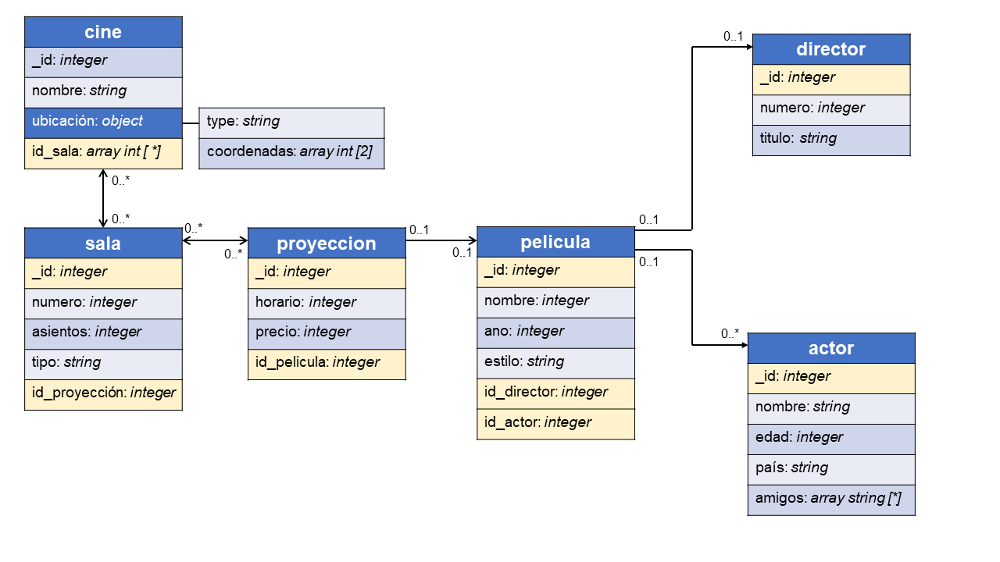

# Tarea 3. Bases de datos NoSQL (MongoDB)

---

##### Integrantes:
1. *[Poner aquí Nombre y Apellidos del integrante 1]* - *[Poner aquí su Matrícula]* - *[Poner aquí su campus]*
2. *Sebastian Gonzalo Vives Faus* - *A01025211* - *TEC SF*
3. *[Poner aquí Nombre y Apellidos del integrante 3]* - *[Poner aquí su Matrícula]* - *[Poner aquí su campus]*
4. *[Poner aquí Nombre y Apellidos del integrante 4]* - *[Poner aquí su Matrícula]* - *[Poner aquí su campus]*

---
## 1. Aspectos generales

Las orientaciones de la tarea se encuentran disponibles en la plataforma **Canvas**.

Este documento es una guía sobre qué información debe entregar como parte de la tarea, qué requerimientos técnicos debe cumplir y la estructura que debe seguir para organizar su entrega.


### 1.1 Requerimientos técnicos

A continuación se mencionan los requerimientos técnicos mínimos de la tarea, favor de tenerlos presente para que cumpla con todos.

* El equipo tiene la libertad de elegir las tecnologías de desarrollo a utilizar en la tarea, sin embargo, debe tener presente que la solución final se deberá ejecutar en una plataforma en la nube. Puede ser  [Google Cloud Platform](https://cloud.google.com/?hl=es), [Azure](https://azure.microsoft.com/en-us/), [AWS](https://aws.amazon.com/es/free/) u otra.
* La arquitectura de la solución deberá estar separada claramente por capas (*frontend*, *backend*, datos y almacenamiento).
* Todo el código, *scripts* y la documentación de la tarea debe alojarse en este repositorio de GitHub, siguiendo la estructura que aparece a continuación.

### 1.2 Estructura del repositorio

El proyecto debe seguir la siguiente estructura de carpetas:
```
- / 			        # Raíz de toda la tarea
    - README.md			# Archivo con la información general de la tarea (este archivo)
    - frontend			# Carpeta con la solución del frontend (Web app)
    - backend			# Carpeta con la solución del backend (API)
    - scripts		        # Carpeta con los scripts necesarios para generar la base de datos, cargar datos y ejecutar las consultas
    - database			# Carpeta con el modelo de la bases de datos utilizando JSON Schema

```

### 1.3 Documentación de la tarea

Como parte de la entrega de la tarea, se debe incluir la siguiente información:

* Diagrama del *Modelo de la base de datos utilizando JSON Schema*.
* *Scripts* para generar la base de datos, cargar datos y ejecutar consultas.
* Guía de configuración, instalación y despliegue de la aplicación en la plataforma en la nube  seleccionada.
* El código debe estar documentado siguiendo los estándares definidos para el lenguaje de programación seleccionado.

## 2. Solución

A continuación aparecen descritos los diferentes elementos que forman parte de la solución de la tarea.

### 2.1 Modelo de la *base de datos* 

[Modelo JSON Schema](database/DatabaseJsonScheme.json)

Este modelo fue creado en la página web: https://jsonschema.net/ [Version Draft-07]
Cada documento consiste de un schema, el cual contiene un tipo, variables requeridas y sus propiedades. En sus propiedades, se encuentra el schema de cada una de las variables, el cual incluye: su tipo (si es integer, string, object, etc), una descripcion y un ejemplo del mismo. Si la variable llega a ser un objeto, aplica la misma funcionalidad, donde se describe cada una de sus propiedades d ela misma manera. Finalmente, si la variable es un arreglo, se describen las propiedades de los items dentro de ese arreglo.

### 2.2 Arquitectura de la solución



### 2.3 Frontend

*[Incluya aquí una explicación de la solución utilizada para el frontend de la tarea. No olvide incluir las ligas o referencias donde se puede encontrar información de los lenguajes de programación, frameworks y librerías utilizadas.]*

#### 2.3.1 Lenguaje de programación
#### 2.3.2 Framework
#### 2.3.3 Librerías de funciones o dependencias

### 2.4 Backend

*[Incluya aquí una explicación de la solución utilizada para el backend de la tarea. No olvide incluir las ligas o referencias donde se puede encontrar información de los lenguajes de programación, frameworks y librerías utilizadas.]*

#### 2.4.1 Lenguaje de programación
#### 2.4.2 Framework
#### 2.4.3 Librerías de funciones o dependencias

## 2.5 Pasos a seguir para utilizar la aplicación

*[Incluya aquí una guía paso a paso para poder utilizar la aplicación, desde la clonación del repositorio hasta el despliegue de la solución en una plataforma en la nube.]*

## 3. Referencias

*[Incluya aquí las referencias a sitios de interés, datasets y cualquier otra información que haya utilizado para realizar la tarea y que le puedan ser de utilidad a otras personas que quieran usarlo como referencia]*
